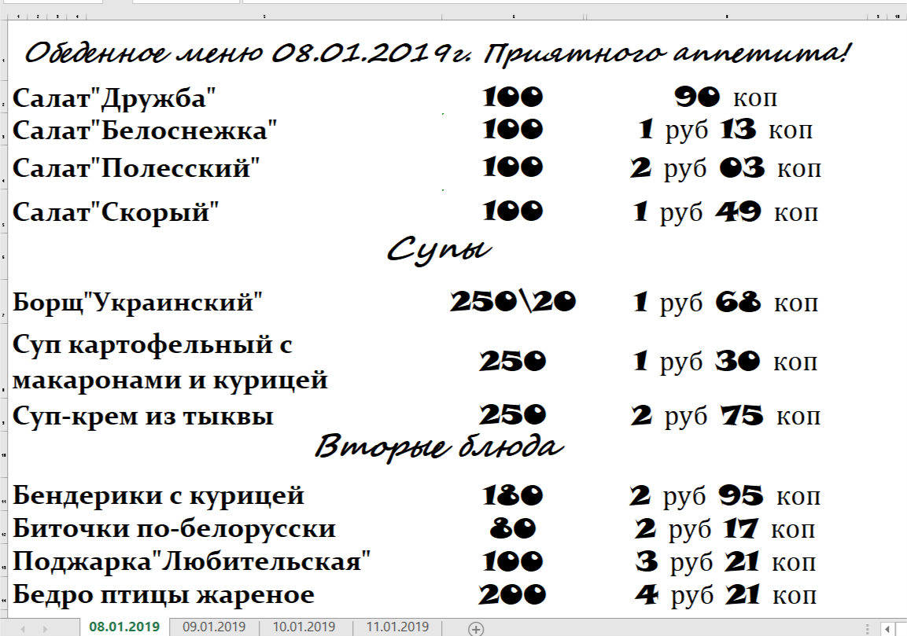

## What is going on with menus in a canteen

There is a canteen on the first floor of P27a office. People from the canteen send menus in Excel format on a weekly basis. Every such file contains a menu for current week, one day per a spreadsheet.

We are interested in data extraction from the Excel files, putting the data into a table format. Once it is done, next step of data analysis can be implemented.

Here is how a menu for a day might looks like:

 

